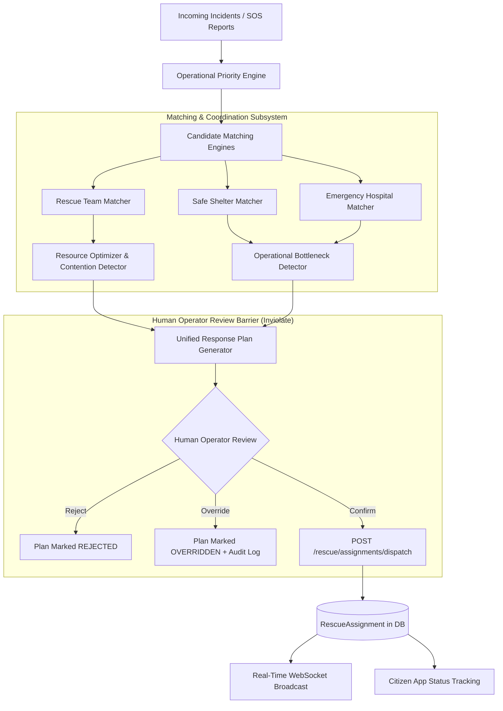

# AI-DisasterGuard — Phase 5.5: Disaster Operations Intelligence Architecture

> **Predict Early. Warn Faster. Respond Smarter.**

---

## 1. Executive Overview

Phase 5.5 transforms AI-DisasterGuard from an alert and single-incident recommendation system into a comprehensive **Disaster Operations Intelligence and Multi-Incident Resource Optimization System**.

In disaster operations, emergency services face:
1. **Multiple simultaneous distress incidents** competing for limited rescue assets.
2. **Specialized operational constraints** (e.g. swift-water vs high-ground vs medical evac).
3. **Dynamic facility bottlenecks** (shelter saturation, trauma bed shortages).
4. **Information uncertainty and telemetry degradation** in disrupted communication theaters.

Phase 5.5 addresses these challenges through explainable, capacity-aware, and contention-detecting intelligence while maintaining the **Inviolate Human Confirmation Barrier** established in Phase 3.5.

---

## 2. Subsystem Architecture

The Phase 5.5 architecture is partitioned across four operational layers:



---

## 3. Incident Priority Engine & 5-Part Explainable Evidence

The incident priority engine (`ml/operations/incident_priority.py`) calculates an explainable priority score between **0 and 100** and categorizes incidents into operational priority tiers:
- **CRITICAL** (90–100): Immediate life-safety threat; priority dispatch recommended.
- **HIGH** (70–89): Severe threat requiring specialized intervention.
- **MEDIUM** (40–69): Active hazard requiring monitored assistance.
- **LOW** (0–39): Advisory / minor condition.

### Multi-Factor Scoring Taxonomy

$$\text{Priority Score} = \min\left(100, \sum w_i \cdot x_i\right)$$

| Operational Factor | Weight (Points) | Condition & Rationale |
|---|---|---|
| **Trapped Persons** | $+30$ | Verified distress report or NLP keywords indicate victims stranded on roofs, upper floors, or trapped in single-story homes. |
| **Medical Emergency** | $+25$ | Unconscious, bleeding, diabetic, pregnant, or injured victims requiring acute medical stabilization. |
| **Immediate Life Threat** | $+20$ | Fast-rising water, chest/neck-deep water, or submerged structures. |
| **Flood Susceptibility** | $+10$ | Geospatial intersection with high susceptibility flood zone ($\ge 0.60$). |
| **Forecast Risk Trajectory** | $+10$ | Multi-horizon forecast model predicts `INCREASING` or `PEAKING` risk. |
| **Incident Age** | $+5$ | Incident remains unassigned / pending for $> 15$ minutes without intervention. |

### 5-Part Categorical Evidence Framework
Each score is accompanied by decomposed evidence across five standardized categories:
1. **FACT**: Ground truth observations (e.g. *4 elderly persons reported chest-deep in water*).
2. **ML_PREDICTION**: Machine learning forecast outputs (e.g. *Multi-horizon model indicates risk trajectory is INCREASING to peak at 6H*).
3. **GEOSPATIAL_DERIVATION**: Spatial analytics (e.g. *Incident coordinates intersect Adyar River Basin high-susceptibility zone*).
4. **AI_INTERPRETATION**: Synthesized operational appraisal (e.g. *Compound life-safety threat combining trapped occupants with urgent medical needs*).
5. **RECOMMENDATION**: Actionable decision support (e.g. *IMMEDIATE OPERATOR ACTION: Prioritize for rescue team assignment and dispatch confirmation*).

---

## 4. Candidate Matching Intelligence

### A. Rescue Team Capability Matching
Evaluates rescue squads across five criteria:
1. **Capability Alignment (35 pts)**: Matches required skills (`BOAT_RESCUE`, `SWIFT_WATER`, `HIGH_CLEARANCE`, `MEDICAL`, `EVACUATION`).
2. **Availability Status (25 pts)**: Scores `AVAILABLE` units highest, `STANDBY` moderately, and filters `BUSY` / `OFFLINE`.
3. **Geographic Proximity (20 pts)**: Haversine distance from incident to team's last ping. **Always explicitly labeled "Approx. geographic distance"** to reflect road disruption reality.
4. **Workload Balance (10 pts)**: Penalizes squads with higher active dispatches to prevent crew exhaustion.
5. **Telemetry Freshness (10 pts)**: Penalizes teams whose GPS update is $>15$ minutes old.

### B. Capacity-Aware Safe Shelter Matching
Matches safe evacuation destinations with explicit hazard avoidance:
- **Capacity Filtering**: Checks available spaces ($total - current\_occupancy$) to ensure room for evacuees.
- **Flood Risk Exposure Check**: Evaluates if the shelter itself sits in a high flood risk zone; emits prominent operational warnings if flood exposure is detected.
- **Geographic Proximity**: Calculates approx. distance.
- **Amenity Suitability**: Matches medical bays, backup generators, and dry storage.

### C. Emergency Hospital Matching
Evaluates medical destination suitability:
- **Trauma Center Capability**: Prioritizes Level 1 / Level 2 trauma facilities for critical injuries.
- **Emergency Bed Availability**: Tracks available emergency beds and ICU bed headroom.
- **Proximity**: Approx. geographic distance.
- **Provenance Tagging**: Every record identifies data provenance (`REAL`, `CACHED`, `MOCK`, `SIMULATION`).

---

## 5. Unified Response Plan & Confirmation Barrier

The system generates a unified **Response Plan** object containing:
- Recommended primary rescue team, safe shelter, and emergency hospital.
- Ranked alternative candidates for each resource category.
- Aggregated operational warnings (contention, bottlenecks, capability gaps, stale telemetry).
- Overall confidence rating (`HIGH`, `MEDIUM`, `LOW`).
- **`human_confirmation_required: true` (Strict Invariant)**.

### Strict Human Confirmation Barrier
```text
┌────────────────────────────────────────────────────────┐
│               AI / ML Operations Engine                │
│    - Evaluates incidents                               │
│    - Computes priority scores                          │
│    - Recommends teams, shelters, hospitals             │
│    - Identifies contentions & bottlenecks              │
│    - Creates ResponsePlan (Status: RECOMMENDED)        │
│    ────────────────────────────────────────────────    │
│    CRITICAL INVARIANT: ZERO DISPATCHES CREATED         │
└───────────────────────────┬────────────────────────────┘
                            │
              [ResponsePlan in Database]
                            │
                            ▼
┌────────────────────────────────────────────────────────┐
│               Human Operator Terminal                  │
│    - Reviews explainable evidence & warnings           │
│    - Option A: Confirm recommended dispatch            │
│    - Option B: Override with alternative unit + reason │
│    - Option C: Reject recommendation with notes        │
└───────────────────────────┬────────────────────────────┘
                            │
               Explicit POST /dispatch request
                            │
                            ▼
┌────────────────────────────────────────────────────────┐
│             Rescue Assignment Created                  │
│    - Exactly 1 RescueAssignment created in DB          │
│    - Immutable RescueDispatchAuditLog recorded         │
│    - Real-time WebSockets broadcast                    │
│    - Citizen status updated honestly                   │
└────────────────────────────────────────────────────────┘
```

---

## 6. Real-Time Operational Status Lifecycle

Responders progress through an honest operational lifecycle that synchronizes across the Command Centre and Citizen App:

| Status Code | Responders | Citizen Application Representation |
|---|---|---|
| `PENDING` / `RECOMMENDED` | Available in depot / on patrol | **UNDER REVIEW**: Emergency call received and being prioritized by command operators. |
| `DISPATCHED` | Order confirmed by human operator | **RESCUE SQUAD ASSIGNED**: Squad assigned and preparing deployment. |
| `EN_ROUTE` | Traveling toward scene | **RESCUE SQUAD EN ROUTE**: Responders in transit with live distance tracking. |
| `ON_SCENE` | Operating at scene | **RESCUE SQUAD ON SCENE**: Responders arrived; citizen advised to remain in safe position. |
| `RESOLVED` | Mission complete | **EMERGENCY RESOLVED**: Evacuation completed; citizen confirmed safe. |

No stage creates false reassurance or simulates transit without verified state updates.
