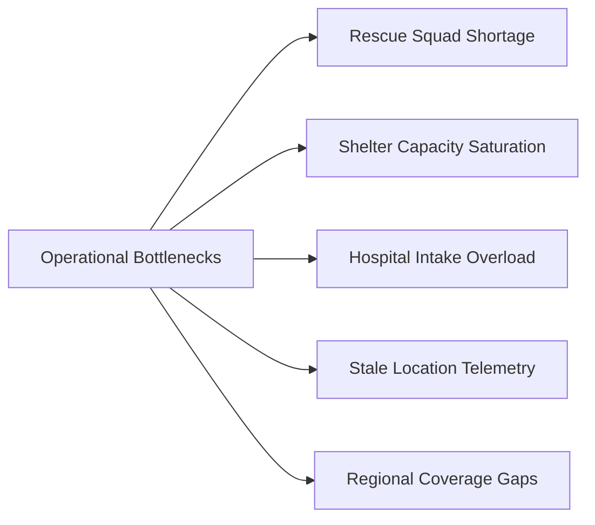

# AI-DisasterGuard — Phase 5.5: Multi-Incident Resource Optimization & Contention Detection

> **Predict Early. Warn Faster. Respond Smarter.**

---

## 1. Multi-Incident Coordination Challenge

During large-scale regional disaster events, multiple emergencies occur simultaneously in close geographic proximity. Without intelligent coordination:
- Multiple dispatchers inadvertently assign the same rescue squad to different incidents.
- Nearest units are depleted on moderate incidents, leaving critical life-safety emergencies without coverage.
- Saturated shelters and overloaded hospitals create transport logjams and critical care delays.
- Stale telemetry causes units to be dispatched based on out-of-date location assumptions.

The **Resource Optimization Subsystem** (`ml/operations/resource_optimizer.py` and `bottleneck.py`) provides systematic decision support without ever making autonomous dispatches.

---

## 2. Resource Contention Detection

### What is Resource Contention?
Resource contention occurs when **two or more active emergencies** identify the **same rescue squad** as their primary candidate:

$$\mathcal{C}(R) = \{ I_1, I_2, \dots, I_k \mid \text{Recommended}(I_j) = R \text{ for } k \ge 2 \}$$

### Detection & Precedence Algorithm
1. The optimization engine gathers all active, unassigned incidents and scores them using the multi-factor operational priority engine.
2. For each incident, candidate rescue squads are evaluated and ranked.
3. If a squad $R$ is ranked $\#1$ for more than one incident, a `ResourceContention` event is recorded.
4. **Precedence Ranking**: The incident with the highest operational priority score is designated as having the **PRIMARY_CLAIM**:
   $$\text{Preferred Incident} = \arg\max_{I \in \mathcal{C}(R)} \text{PriorityScore}(I)$$
5. **Secondary Claim Handling**:
   - Secondary incidents are flagged with `CONTENTION_CONFLICT`.
   - The engine automatically designates the next best alternative candidate unit for the secondary incident.
   - An explainable conflict description is provided for the human operator (e.g., *Squad Alpha is also recommended for higher-priority Incident #245 (Score 100). Suggested alternative: Squad Bravo.*).
6. **Zero Auto-Dispatch Rule**: Under NO circumstances does the contention engine reassign, cancel, or dispatch any squad. Dispatches remain strictly in the hands of the authorized human operator.

### Contention Severity Matrix
- **CRITICAL**: Competing incidents both feature trapped individuals or acute medical emergencies ($\text{Score} \ge 90$).
- **HIGH**: At least one incident is classified as HIGH priority ($\text{Score} \ge 70$).
- **MODERATE**: Both incidents are in MEDIUM priority tier ($\text{Score} < 70$).

---

## 3. Operational Bottleneck Detection

The `BottleneckDetectorEngine` (`ml/operations/bottleneck.py`) continuously monitors five system-wide operational constraints:



### 1. Rescue Squad Shortage (`RESCUE_SHORTAGE`)
- **Trigger**: $\text{Count}(\text{Urgent Incidents}) > \text{Count}(\text{Available Squads})$.
- **Metrics**: Quantifies exact deficit and competing urgent calls.
- **Guidance**: Recommends requesting mutual aid or transitioning standby crews to active duty.

### 2. Shelter Capacity Saturation (`SHELTER_SHORTAGE`)
- **Trigger**: Cumulative shelter occupancy reaches $\ge 85\%$ or total remaining capacity $< 50$ evacuees.
- **Metrics**: Total regional capacity, current occupancy percentage, available headcount.
- **Guidance**: Advises command operators to designate secondary evacuation centers or open municipal relief schools.

### 3. Hospital Intake Strain (`HOSPITAL_OVERLOAD`)
- **Trigger**: Total available emergency trauma beds $< 10$ across the sector or any facility reaches 100% saturation.
- **Metrics**: Available trauma beds, saturated facility count.
- **Guidance**: Coordinates patient diversion protocols and activates mobile field triage units.

### 4. Degraded Location Telemetry (`STALE_TELEMETRY`)
- **Trigger**: Any active rescue team's last ping update is $> 15$ minutes old.
- **Mitigation**: Prompts command dispatcher to initiate VHF radio telemetry check or cellular re-polling.

### 5. Regional Coverage Gaps (`COVERAGE_GAP`)
- **Trigger**: A CRITICAL or HIGH severity incident has no available qualified rescue squad within $15\text{ km}$.
- **Mitigation**: Flags deployment deficit and suggests staged redeployment of distant available squads.

---

## 4. Multi-Incident Optimization Data Contract

```typescript
export interface ResourceContention {
  id?: number;
  resource_id: number;
  resource_name: string;
  incident_ids: number[];
  preferred_incident_id: number;
  severity: "CRITICAL" | "HIGH" | "MODERATE";
  description: string;
  contending_incidents_detail: Array<{
    incident_id: number;
    priority_score: number;
    priority_level: string;
    reasons: string[];
  }>;
}

export interface OperationalBottleneck {
  id?: number;
  zone: string;
  bottleneck_type: "RESCUE_SHORTAGE" | "SHELTER_SHORTAGE" | "HOSPITAL_OVERLOAD" | "STALE_TELEMETRY" | "COVERAGE_GAP";
  severity: "CRITICAL" | "HIGH" | "MODERATE";
  description: string;
  guidance: string;
  metrics?: Record<string, any>;
}
```

---

## 5. Decision-Support Invariant Verification

To ensure that the optimizer remains decision-support only:
- **No Background Dispatches**: The optimizer generates database recommendation entities with status `RECOMMENDED`, never creating `RescueAssignment` records.
- **No Auto-Preemption**: Existing assignments are NEVER cancelled or superseded by background jobs.
- **Human Authority**: Operators can follow recommendations, select suggested alternatives, or override with arbitrary squad selection. All actions are logged with explicit rationale in `rescue_dispatch_audit_logs`.
